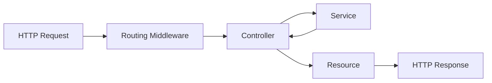

<p align="center"><a href="https://laravel.com" target="_blank"></a></p>

# Backend Test - Cloud Humans

Based on their skills, professionals (Pros) are assigned projects. The system assesses which project is most appropriate for Pro using an intricate algorithm based on data provided via the Pro Portal. The infrastructure for the project is comprised of an API that receives data from the front-end application, applies the allocation mechanism, and gives the Pro access to the chosen project.


## 🚀 starting

These instructions will allow you to get a copy of the project running on your local machine for development and testing purposes.

### 📋 Prerequisites

What things do you need to install the software and how do you install it?

|Technologies    |PHP                            |Composer                     |
|----------------|-------------------------------|-----------------------------|
|Version         |`8.3.1`                        |`2.6.6`                      |

### 🔧 Installation
1. Clone the repository:
```
git clone https://github.com/JosePedro-22/Backend-Test.git
```
2. Navigate to the project directory:
```
cd Backend-Test
```
3. Install dependencies:
```
composer install
```

### Use postman to test the api

### Access the route 
```http://127.0.0.1:8000/api/pro/select-project```

### Put it in the header
Key:
```Accept```
Value:
```application/json```

### Put it on the body:
```
{
  "age": 35,
  "education_level": "high_school",
  "past_experiences": {
    "sales": false,
    "support": true
  },
  "internet_test": {
    "download_speed": 50.4,
    "upload_speed": 40.2
  },
  "writing_score": 0.6,
  "referral_code": "token1234"
}
```

### your output:
```
    "score": 4,
    "selected_project": "support_users_from_xyz",
    "eligible_projects": [
        "support_users_from_xyz",
        "collect_information_for_xpto"
    ],
    "ineligible_projects": [
        "calculate_dark_matter_nasa",
        "determine_schrodinger_cat_is_alive"
    ]
```

## ⚙️ Running the tests

To run test

```
php artisan test
```

### 🔩 Unitary tests (Unit Tests):

To run the test, run the command

```
php artisan test tests/Unit/app/Services/ScoreServiceTest.php
```

### 🔩 End-to-End Tests (Feature Tests):

To run the test, run the command

```
php artisan test tests/Feature/app/Http/Controllers/ProControllerTest.php
```

## 🎲 The main technical decisions I made: 

* Language and Framework: Laravel is a popular choice for developing PHP web applications due to its elegant syntax and comprehensive feature set. Furthermore, the PHP language is widely used and has a large community of developers and resources available.
* Architecture: We chose to apply the principle of Domain-Driven Design (DDD) to organize the code into distinct layers. This helps maintain a clear separation of responsibilities and facilitates application maintenance and scalability.
* Tests: Unit tests and end-to-end tests were implemented to ensure code quality and correct application functionality. Testing helps identify and fix problems earlier in the development cycle.
* Data Validation: Data validation has been implemented to ensure that the data received by the API is correct and complete. This helps prevent errors and security issues.
* API Output: Using the Eloquent's resource class allows you to expressively and easily transform your models and model collections into JSON.

## 💬 comments about the project:
#### Diagrams of the path from request to response


## 🎲 Other
|Name Branch     |Description                                                  |
|----------------|-------------------------------------------------------------|
|main            |base project, implementation of the algorithm to select which projects the pro is eligible or ineligible and his score, use of ddd plus integration of end-to-end and unitary tests|

## 🛠️ Building with

* [Laravel](https://laravel.com/) - The web framework used
* [Composer](https://getcomposer.org/) - Dependency Manager

## ✒️ Authors

* **José Pedro** - *Development / Documentation* - [Developer](https://www.linkedin.com/in/josepedro-sm/)
